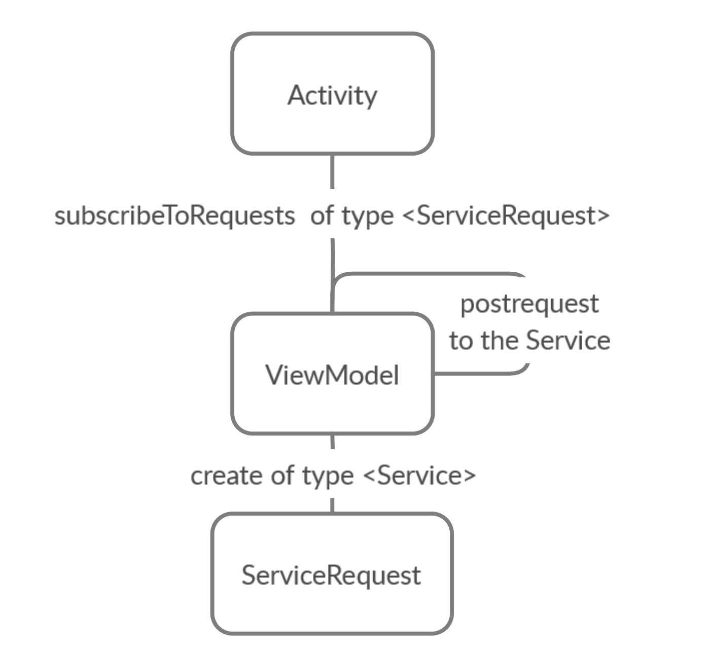

# Services for ViewModels

As viewModels should not be aware of their context (separation of concerns) we have to use another way where the viewModel can use logic that would normally require the current context.

## Explanation

Simplified explanation:


The activity / fragment subscribes to the request of the viewModel and handles them. Since the request is being taken care of inside the avtivity / fragment the context is usually not a problem. The `ServiceRequest` class is just responsible to hold the requests. The service in the parent subscribes to any changes and handles posted requests.

## Usage

ViewModel:
```kotlin
val messageRequest = ServiceRequest<MessageRequest>()

// somewhere in the code
messageRequest.raise(MessageRequest)

```

Parent:
```kotlin
private val messageService: MessageService by inject { parametersOf(this) }

// in on create
messageService.subscribeToRequests(viewModel.messageRequest)
```
